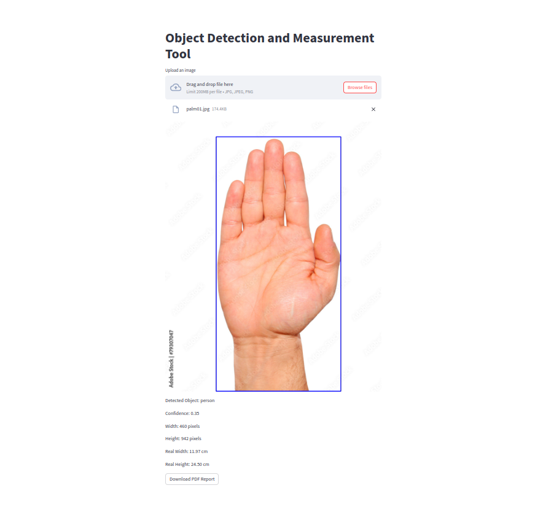

# Measurement App
An interactive Python tool with a web interface that overlays grids on images, measures grid cells, and generates PDF reports. Ideal for analyzing structured image content. Powered by Streamlit, OpenCV, and FPDF.

## Image Grid Measurement and Visualization Tool
This repository contains a Python script and an interactive web interface built using the Streamlit library, OpenCV, and FPDF. The tool allows users to upload an image, overlay a grid on it, measure different cells in the grid, and generate a PDF report with the image measurements.

### What is Measurement App?
The Measurement App is designed to help users analyze and measure the spatial distribution of content within images. It is particularly useful for structured content like maps, diagrams, or layouts. By overlaying a grid on the uploaded image, the app allows users to break down the image into manageable cells and calculate their dimensions. This information is then compiled into a comprehensive PDF report.

## Features
- **Interactive UI**: The Streamlit interface provides an intuitive way to upload an image, adjust the grid step size, and choose whether to show the grid lines.
- **Grid Overlay**: The uploaded image can be overlaid with a grid, helping to divide the image into manageable cells for measurement.
- **Grid Measurement**: The script calculates measurements (width, height) for each cell in the grid, providing insights into the content's spatial distribution.
- **PDF Report Generation**: The tool generates a PDF report containing image dimensions, grid step size, and measurements for each cell.

## How to Use
1. Clone the repository and navigate to the project directory:
    ```sh
    git clone <repository_url>
    cd <repository_directory>
    ```
2. Create a virtual environment and activate it:
    ```sh
    python -m venv venv
    source venv/bin/activate   # On Windows use `venv\Scripts\activate`
    ```
3. Install the required dependencies using the provided `requirements.txt` file:
    ```sh
    pip install -r requirements.txt
    ```
4. Run the Streamlit app:
    ```sh
    streamlit run app.py
    ```
5. Upload an image via the Streamlit interface.
6. Adjust the grid step size using the slider.
7. Choose whether to show the grid lines by checking the checkbox.
8. The interface will display the uploaded image with the grid overlaid.
9. The PDF report with image measurements will be generated and saved.

## Deployment
To deploy the Measurement App, you can use various platforms such as Heroku, AWS, or Google Cloud. Below is a basic guide for deploying the app using Streamlit Sharing:

1. Push your code to a GitHub repository.
2. Go to [Streamlit Sharing](https://streamlit.io/sharing) and sign up or log in.
3. Click on "New app" and fill in the repository details.
4. Deploy the app directly from the GitHub repository.

For detailed instructions on deploying Streamlit apps, refer to the [Streamlit deployment guide](https://docs.streamlit.io/library/get-started/deploy).

## Dependencies
- Streamlit
- OpenCV
- NumPy
- FPDF
- Torch
- Ultralytics

## Example


## License
This project is licensed under the MIT License.

## References
For more information on the libraries and tools used in this project, you can refer to:
- [Streamlit Documentation](https://docs.streamlit.io/)
- [OpenCV Documentation](https://docs.opencv.org/)
- [NumPy Documentation](https://numpy.org/doc/)
- [FPDF Documentation](http://www.fpdf.org/)
- [Ultralytics YOLOv8](https://docs.ultralytics.com/)
